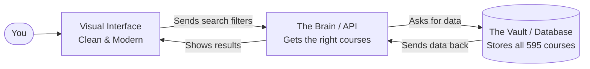
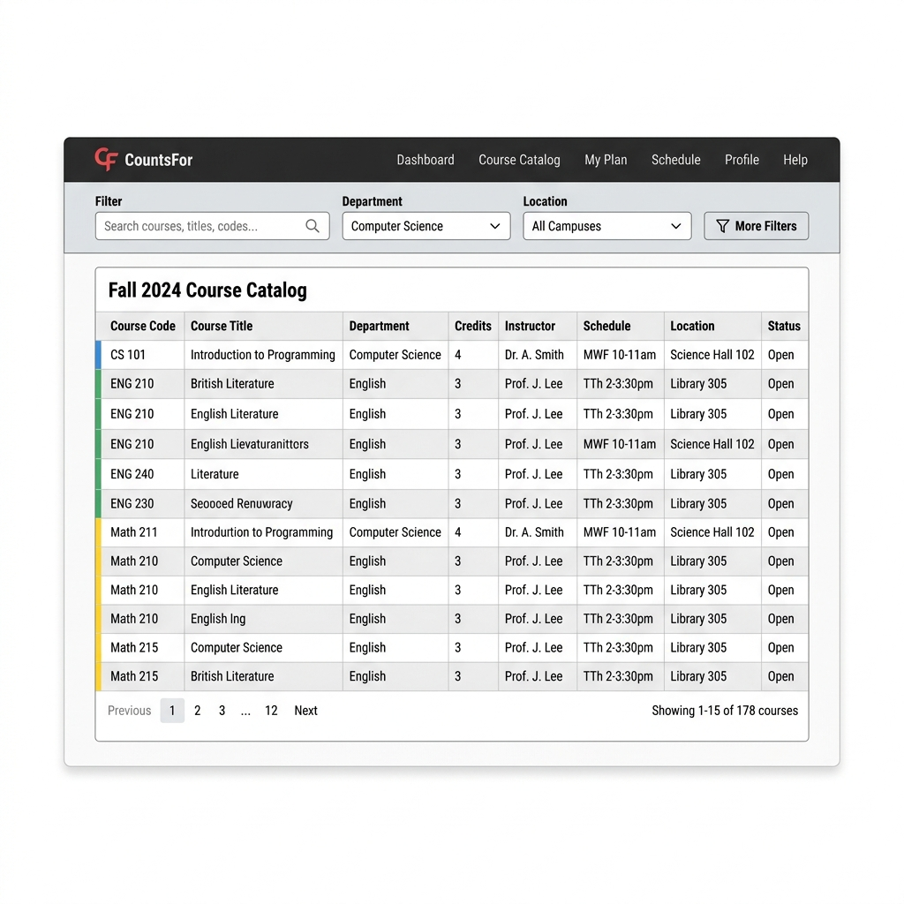
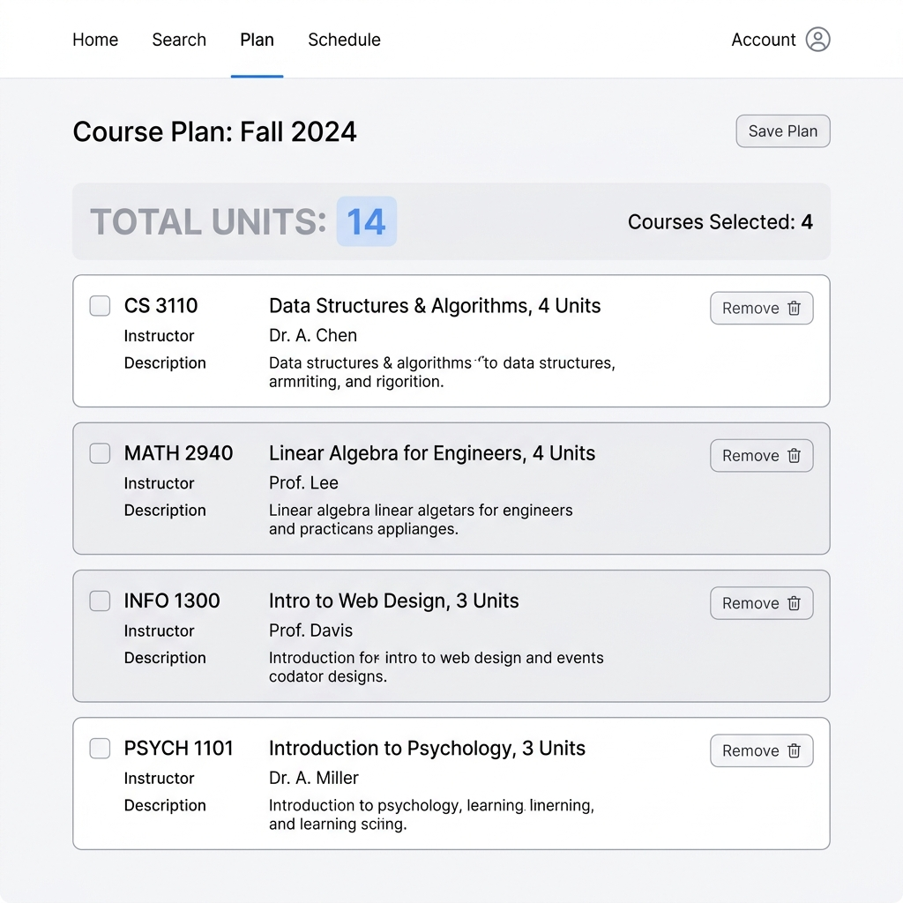
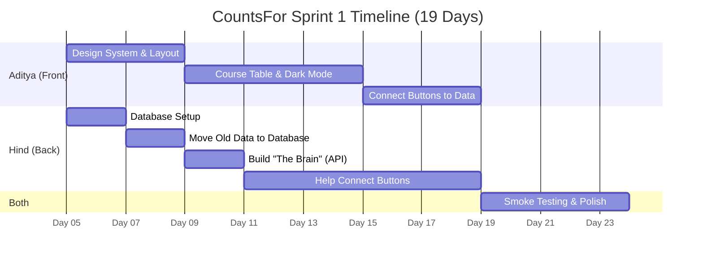

# CountsFor: 3-Week Redesign Proposal

**Prepared by:** Aditya Vivek \& Hind Jendara

Welcome to the **CountsFor** project proposal! We know that not everyone loves reading through technical documents, so we put together this highly visual, easy-to-understand guide. Our goal is to explain exactly what we're going to build over the next 3 weeks to make the CountsFor experience smoother and more modern.

---

## 1. The Big Picture: What Are We Doing?

Currently, CountsFor works, but the design is a bit clunky, the filters don't always do what you expect, and a lot of the visual elements are overwhelming. **We are building a new foundation** so the website looks cleaner and actually uses "live" data.

Here is the simple explanation of how the new app will communicate behind the scenes:

1. **Visual Interface**: What you see and click on (buttons, dropdowns, table).
2. **The Brain**: The middle-man that handles logic, sorting, and fetching.
3. **The Vault**: Where all the course data actually lives.

---

## 2. What Will It Look Like?

We are completely revamping the look and feel to be minimal, responsive, and easy on the eyes. 

### The Main Course Catalog
Below is a concept wireframe of what the main Search/Catalog page will look like. Notice the clean top bar, the organized filters, and the easily readable table.

*Note: This is just a rough conceptual wireframe to give a general idea. The final design will be much more refined and detailed.*

**Key Improvements Here:**
* **Slim Top Bar**: Taking up way less space so you can actually focus on the courses.
* **Unified Filters**: Simple dropdowns for Department, Location, and Course Type all in one row.
* **Muted Colors**: Using softer colors for the different majors (BA, BS, CS, IS) so it's not blindingly bright.
* **Working Sort**: Clicking the tops of the columns will actually sort the rows properly!

### The 'My Plan' Tab
One of the most important features is letting you select courses and save them for your advising meetings.

*Note: This is just a rough conceptual wireframe to give a general idea. The final design will be much more refined and detailed.*

**Key Improvements Here:**
* **Running Total**: Easily see how many units you are currently "registered" for.
* **Clean List**: A straightforward list of what you've picked.
* **Auto-Save**: If you refresh the page or close your laptop, your plan will still be there when you come back.

---

## 3. Our 3-Week Timeline

We have about **60 total hours** between our two developers. Here is how we break down the work visually without getting into the tech jargon.

### The Breakdown:
* **Week 1:** Aditya builds the visual skeleton (buttons, colors, layout) while Hind builds the foundation (The Brain and The Vault). 
* **Week 2:** Aditya makes the tables look pretty and adds Dark Mode. Together, they connect the visual buttons to "The Brain" so they actually function.
* **Week 3:** They test everything extensively to make sure they haven't broken anything, completing Phase 1 of development.

---

## 4. What Are We NOT Doing Right Now?

To make sure we actually finish this in 3 weeks, we have to say "no" to a few things. These are **deferred** to the summer:

1. **Mobile Layout**: We will make sure it doesn't break on your phone, but it won't be perfectly optimized for small screens yet. 
2. **Fancy Animations**: No sliding panels or bouncy buttons yet.
3. **Analytics Dashboard**: The charts and graphs will come later.
4. **Auto-updating Semesters**: For now, the course data is a snapshot. In the future, we will make it update automatically with the registrar.

---

## 5. Summary

By **April 23**, Phase 1 of development will be completely finished! While we aren't officially releasing to users just yet, the core foundation will be built out: anytime we run CountsFor internally, we will be greeted with a polished, modern, and snappy interface. If we apply a filter, it will work. If we save a course to the plan, it will stay there. We are skipping the bells and whistles to give you a highly reliable core experience first.
