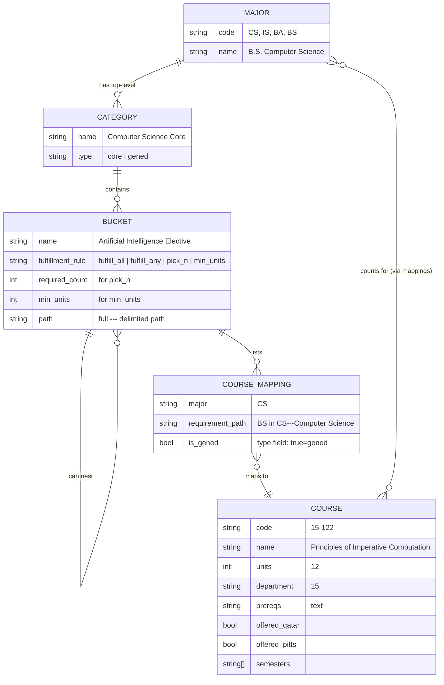

# CountsFor Redesign: Complete Product Design Document

---

## 1. Core Diagnosis

### Why the current system is confusing

The confusion in CountsFor is not cosmetic — it is **structural**. The interface fails because the data model and the presentation model are fundamentally misaligned.

#### The underlying data is a directed graph, but it's displayed as a flat table

The actual data has this shape:

```
Major → Category → Bucket → Sub-bucket → Course
```

A course like `21-259 Calculus in Three Dimensions` has **7 distinct mappings** across 3 majors, each at a different position in a different hierarchy. It is:
- **CS Core**: Mathematics and Probability → Calculus → 3D Calculus
- **BA Core**: Business Foundations → Mathematics → Multivariate Analysis
- **BS Core**: Biological Sciences Electives → Interdisciplinary Electives Group
- **BS Core**: Options → Biochemistry → Required Biology Electives → Advanced Calculus
- **BS Core**: Options → Biophysics → Required Biology Electives
- **BS GenEd**: Mathematics, Statistics, and Computer Science
- **BS GenEd**: STEM Course

The current table squashes all of this into four cells on a single row. A student sees "Multivariate Analysis" in the BA column and "Interdisciplinary Electives Group" in the BS column. But they have no idea where those buckets live in the requirement hierarchy, whether they're mandatory or optional, how many courses the bucket needs, or what "Interdisciplinary Electives Group" even means in context.

#### The five specific confusions

1. **Context collapse.** A bucket name like "Required Biology Electives" means nothing without its parent path. Is it under Options → Biochemistry or Options → Neuroscience? The table strips out the path. Students misread requirements because they cannot see where a bucket sits in the tree.

2. **Fulfillment logic is invisible.** Buckets have rules: "fulfill all," "fulfill any," "pick 1," "at least 18 units," "at most 3 courses." None of this appears anywhere. A student cannot tell whether they need to take every listed course or just one of them.

3. **Cross-major behavior is unreadable.** When 15-122 shows "Computer Science" under CS and "Scientific Reasoning" under BA, it is unclear whether it's core in both, elective in one, or filling a GenEd in another. The distinction between core requirement and general education is buried.

4. **No entry point for the most common task.** Students don't usually start with a random course — they start with a requirement they need to fill. "I need to satisfy my Category 2 requirement" or "I need a Data Science elective." The current table forces them to scan hundreds of rows instead of navigating directly to the bucket.

5. **Scale overwhelms.** 1,727 courses across 174 unique requirement buckets. Even with filtering, the table shows dozens of columns of pill badges that demand line-by-line reading. The information density prevents scanning.

#### What the current prototype gets right and wrong

The friend's two-panel prototype has the **correct conceptual model**: two inverse queries on the same data. The left panel answers "what does this course count for?" and the right panel answers "what courses fill this requirement?"

**What it gets right:**
- Two core questions as the organizing principle
- Color-coded major badges that are instantly recognizable
- "Also counts for" indicators on the requirement panel
- Cross-linking between panels when you click a course

**What it gets wrong:**
- The right panel shows a **flat list** of courses, not the **requirement tree**. A student looking at CS requirements cannot see the hierarchy — they just get a dropdown of unorganized bucket names.
- The dark developer aesthetic is tonally wrong for a university product.
- The requirement names are displayed raw and long. "Science/Engineering, Any Department (4 courses)" is a phrase, not a scannable label.
- There is no way to browse the full requirement structure of a major.
- There is no progressive disclosure — everything is shown at the same level of detail.
- No indication of fulfillment logic (how many courses needed, units required, etc.).

---

## 2. Design Principles

These seven principles should govern every design decision:

**P1 — Question-first, not data-first.** The interface should be organized around user questions ("What does this count for?" / "What fills this?"), not around the raw data structure.

**P2 — Show the tree, not the table.** Requirements are hierarchical. The primary representation must be a navigable tree, not a flat grid. A table can exist as a secondary view, but the tree must be primary.

**P3 — Reveal fulfillment logic.** Every bucket must clearly state its rule: "take all 3," "pick any 1," "≥18 units," "optional." This is the single most important piece of information after the bucket name itself.

**P4 — Distinguish core from elective from GenEd.** These three categories mean very different things to students. The visual system must make the distinction immediate — not hidden in text, but shown through color, position, or iconography.

**P5 — Context-preserving navigation.** When a student is looking at a course, they should be able to see exactly where each requirement mapping sits in the full tree — not just the leaf name, but the full path. When looking at a requirement, they should see where it sits relative to its siblings.

**P6 — Progressive disclosure over exhaustive display.** Start with the minimum information needed to answer the current question. Let users drill deeper on demand. Never show 1,727 courses at once.

**P7 — Cross-major clarity.** When a course counts for multiple majors, the interface should make it trivially easy to compare how it behaves in each — without flipping between tabs or remembering column positions.

---

## 3. Best Product Concept: The Dual-Lens Explorer

### The concept in one sentence

CountsFor should be a **dual-lens explorer** where users can enter from either direction — starting from a course or starting from a requirement — with both lenses deeply interlinked and sharing a visual language that makes the hierarchical requirement structure legible.

### Why not a table

A table is **the wrong primitive** for this data for three reasons:

1. Hierarchical data flattened into cells loses its structure. A bucket called "Required Biology Electives" has different meaning under "Options → Biochemistry" vs. "Options → Neuroscience," but a table cell can only show one label.
2. Tables optimize for comparison across rows, but students are not comparing courses row-by-row. They are either drilling into one course or exploring one requirement tree.
3. Tables scale poorly. At 1,727 rows × 7+ columns, the table becomes a spreadsheet that requires expertise to use.

### Why not a single-view search

A pure search interface (like the prototype's left panel alone) fails because:

1. Students often don't know which course to search for — they need to browse requirements.
2. It can't show the hierarchical structure of a major's requirements.
3. It doesn't help with the second core question: "What courses fill this bucket?"

### The dual-lens approach

The interface has **two primary entry points**, presented side-by-side on desktop or as two distinct modes on mobile:

```
┌─────────────────────────┬──────────────────────────────┐
│  LENS 1: Course Lookup  │  LENS 2: Requirement Map     │
│                         │                              │
│  "What does 15-122      │  "What courses satisfy       │
│   count for?"           │   the AI Elective?"          │
│                         │                              │
│  Search bar + results   │  Major selector + tree       │
│  → Course card with     │  → Expandable requirement    │
│    all mappings shown   │    tree with courses listed  │
│    per major            │    at each leaf              │
└─────────────────────────┴──────────────────────────────┘
```

**The key innovation:** The two lenses are **cross-linked**. Clicking a requirement name in Lens 1 scrolls/highlights it in Lens 2. Clicking a course in Lens 2's tree opens it in Lens 1. This creates a fluid exploration loop where students continuously refine their understanding.

### Why this is the best concept

1. **It eliminates the "where do I start?" problem.** Students with a course code go left. Students with a requirement in mind go right. Neither is privileged.
2. **It preserves hierarchy.** Lens 2 shows the full requirement tree, making structure visible.
3. **It surfaces fulfillment logic.** Each tree node carries its rule chip.
4. **It enables cross-major comparison.** Lens 1 shows all majors for a course simultaneously.
5. **It handles scale.** Neither lens ever shows 1,727 items — they're always scoped to one course or one requirement subtree.

---

## 4. Information Architecture

### Core entities and their relationships



### The requirement path as the key abstraction

The existing API returns requirement names as `---` delimited paths:
```
BS in Computer Science---Mathematics and Probability---Calculus---3D Calculus
```

This is actually a **tree address**. The redesign should parse these paths into a navigable tree for each major, where:
- Level 1: Top category (e.g., "Computer Science," "Mathematics and Probability," "GenEd")
- Level 2: Bucket group (e.g., "Calculus")
- Level 3+: Specific sub-buckets (e.g., "3D Calculus")

Each node in the tree needs:
- A **human-readable label** (the last segment of the path)
- A **fulfillment rule indicator** derived from the data or the audit specs
- A **count** of how many courses map to it
- Its **children** (sub-buckets)
- Its **courses** (leaf-level course mappings)

### How the interface exposes these relationships

| User question | Interface element | Data source |
|---|---|---|
| "What does 15-122 count for?" | Course Card with major-grouped requirement list | All COURSE_MAPPINGs for that course |
| "What fills the AI Elective?" | Requirement node expanded to show course list | All courses mapped to that path prefix |
| "Is this core or GenEd?" | Visual badge on each mapping (solid = core, outlined = gened) | `type` field in mapping |
| "How many courses do I need?" | Rule chip on the tree node ("pick 1", "take all", "≥18u") | Derived from audit structure |
| "Where does this bucket sit?" | Breadcrumb path above the expanded node | Parsed from `---` path |
| "What's different across majors?" | Cross-major comparison in Course Card | Grouped mappings by major |

---

## 5. UI Representation System

### 5A. Major identity system

Each major gets an **immutable color identity** used everywhere:

| Major | Color | Hex | Usage |
|---|---|---|---|
| CS | Blue | `#3B82F6` | Left border, badges, header, tree accent |
| IS | Amber | `#D97706` | Left border, badges, header, tree accent |
| BA | Rose | `#E11D48` | Left border, badges, header, tree accent |
| BS | Emerald | `#059669` | Left border, badges, header, tree accent |

**Confusion removed:** Students never have to read text to identify which major a piece of information belongs to. The color alone identifies it instantly.

**Why better than a table:** In the current table, column headers label the majors, but within the cells, there's no color differentiation beyond pastel backgrounds. A dedicated color system on every element makes the major identity inescapable.

### 5B. Requirement type badges

Three visual treatments distinguish the types:

```
┌──────────┐   ┌╌╌╌╌╌╌╌╌╌╌┐   ┌──────────┐
│   CORE   │   ╎  ELECTIVE ╎   │  GEN ED  │
│  (solid) │   ╎ (dashed)  ╎   │(outlined)│
└──────────┘   └╌╌╌╌╌╌╌╌╌╌┘   └──────────┘
  Filled bg      Dashed border   Thin solid border
  Bold text      Normal text     Normal text
```

- **Core** (type=false, and appears under the degree-specific section): Solid fill with major color, white text. This is required for the degree.
- **GenEd** (type=true): Thin border with major color, colored text, transparent fill. This fills a general education requirement.
- **Elective** (inferred: buckets with many courses and "fulfill any" or "pick N" logic): Dashed border, lighter color.

**Confusion removed:** Students currently cannot tell if a course is required vs. optional vs. GenEd without reading the bucket name and inferring. The badge makes it visual and instant.

**User question answered faster:** "Is this course important for my major or just filling a GenEd?" — answered by glancing at the badge shape.

### 5C. Fulfillment rule chips

Every bucket node in the requirement tree displays a small rule chip:

| Rule | Chip display | Meaning |
|---|---|---|
| Must take this specific course | `required` | No choice — take this exact course |
| Choose any one from the list | `pick 1` | Multiple options, need exactly 1 |
| Choose any N from the list | `pick N` | Multiple options, need exactly N |
| Minimum units | `≥18 units` | Take enough courses to reach the unit threshold |
| Maximum allowed | `≤3 courses` | Cap on how many can count |
| Take all listed courses | `take all` | Every course in the list is required |
| Optional/waivable | `optional` | Can be waived or skipped |

These chips appear as small, neutral-colored tags immediately to the right of the bucket name in the tree view.

**Confusion removed:** The current system has zero indication of fulfillment logic. A bucket with 30 courses looks the same as a bucket with 1 course. Students cannot tell if they need everything or just one.

### 5D. Course card representation

When a student looks up a course, the card shows:

```
┌──────────────────────────────────────────────────────┐
│  15-122                                     12 units │
│  Principles of Imperative Computation                │
│                                                      │
│  CS Dept · Qatar 🇶🇦 · Pittsburgh 🇺🇸                  │
│  Offered: F25  S25  F24  S24                         │
│  Prereq: 15-112 (min C) or 15-110                    │
│                                                      │
│  ── COUNTS FOR ──────────────────────────────────────│
│                                                      │
│  ┃ CS ┃  Computer Science → CS Core        [CORE]   │
│  ┃    ┃  SCS Electives                     [CORE]   │
│  ├────┤                                              │
│  ┃ IS ┃  Technical Core → CS Requirement   [CORE]   │
│  ├────┤                                              │
│  ┃ BA ┃  University Core → Scientific Rsn  [GENED]  │
│  ├────┤                                              │
│  ┃ BS ┃  Math, Stats & CS                  [GENED]  │
│  ┃    ┃  STEM Course                       [GENED]  │
│  └────┘                                              │
└──────────────────────────────────────────────────────┘
```

Key design choices:
- **Grouped by major**, with the major badge as a left-side stripe (not a column header).
- **Shortened requirement path**: Only the last 2 path segments, joined with " → ". The full path is shown on hover/click.
- **CORE vs GENED badge** on the right side of each row.
- **Each requirement row is clickable** — it navigates to that bucket in the Requirement Map.
- **Majors with zero mappings are omitted** (not shown as empty).

**Why better than a table row:** A table cell can only show a pill badge with a name. The course card shows the full context: where in the hierarchy, what type, and how it behaves differently across each major — all at once, in a single vertically-scanned list.

### 5E. Requirement tree representation

The major's full requirement structure is displayed as a **collapsible tree** (think file explorer / settings panel — familiar to all students):

```
  BS in Computer Science
  ┌─────────────────────────────────────────────────┐
  │  ▾ Computer Science Core                take all│
  │    ├─ 15-122 Principles of Imperative..   12u   │
  │    ├─ 15-150 Principles of Functional..   12u   │
  │    ├─ 15-210 Parallel & Sequential..      12u   │
  │    ├─ xx-213 Intro to Computer Systems    12u   │
  │    │    ├─ 15-213                                │
  │    │    └─ 18-213                                │
  │    ├─ 15-251 Great Ideas in TCS           12u   │
  │    └─ 15-451 Algorithm Design & Analysis  12u   │
  │                                                 │
  │  ▾ CS Electives                          pick 1 │
  │    ├─ ▸ AI Elective                    9 courses│
  │    ├─ ▸ Domains Elective              10 courses│
  │    ├─ ▸ Logics & Languages Elective    10 courses│
  │    └─ ▸ Software Systems Elective      6 courses│
  │                                                 │
  │  ▸ Mathematics & Probability             take all│
  │  ▸ Technical Communication               pick 1 │
  │  ▸ SCS Electives                     ≥19 units  │
  │  ▸ First-year Immigration Course       optional  │
  │  ▸ Computing @ Carnegie Mellon          required │
  │                                                 │
  │  ── General Education ───────────────────────── │
  │  ▸ First Year Writing                            │
  │  ▸ Category 1: Cognition                         │
  │  ▸ Category 2: Economic/Political                │
  │  ▸ Category 3: Cultural Analysis                 │
  │  ▸ Humanities/Arts Electives          ≥30 units  │
  │  ▸ Science & Engineering              ≥30 units  │
  └─────────────────────────────────────────────────┘
```

Key design choices:
- **Two sections**: Degree requirements (top, separated by a line) and General Education (bottom). This is the most important structural distinction.
- **Collapsible nodes**: ▸ means collapsed, ▾ means expanded. Students start with Level 1 expanded and drill in.
- **Course count badges**: Collapsed nodes show how many courses satisfy them (`9 courses`), giving a sense of breadth vs. constraint.
- **Courses at leaves**: When a node is expanded to its deepest level, the actual courses are listed with their code, truncated name, and units.
- **Clicking a course opens the Course Card** in Lens 1.

**Confusion removed:** Students can now see the full structure at a glance. They can see that "AI Elective" is one of four elective buckets under CS Computer Science, and each one needs exactly 1 course.

**Why better than a flat dropdown:** The prototype's right panel uses a flat dropdown of all bucket names. A student selecting from an unordered list of 35 CS requirements has no structural context. The tree shows grouping, nesting, and position.

### 5F. Cross-major comparison for a course

When viewing a course card, the mappings are **grouped by major** with colored left borders. But for deeper comparison, a student can expand any mapping row to see:

```
  ┃ CS ┃  Computer Science → CS Core        [CORE]
  ┃    ┃    ↳ This is one of 6 required courses. You must take all 6.
  ┃    ┃      Other courses in this bucket: 15-150, 15-210, 15-213, 15-251, 15-451
```

This inline expansion removes the need for a separate "comparison view" — the Course Card IS the comparison view.

**User question answered:** "What does it mean that 15-122 is in Computer Science Core?" — the expansion explains the rule and shows the peers.

---

## 6. Key User Flows

### Flow 1: Student knows the course, wants to know what it counts for

1. Student arrives at CountsFor. Sees a prominent search bar in the left lens.
2. Types "15-122" (or "15122" or "imperative").
3. As they type, a dropdown shows matching courses with code, name, and units.
4. Selects the course. The **Course Card** appears showing:
   - Header: code, name, units, department, location, semesters, prereqs
   - "Counts For" section: grouped by major, each with shortened path + CORE/GENED badge
5. Student sees it counts as CS Core, IS Technical Core, BA GenEd, and BS GenEd.
6. Clicks the "Computer Science → CS Core" row. The right panel scrolls to and highlights that node in the CS requirement tree.
7. Student now sees the full context: this is one of 6 courses in the Computer Science Core bucket, all of which are required.

**Time to answer core question:** Under 5 seconds from search to understanding.

### Flow 2: Student knows the requirement, wants to find eligible courses

1. Student clicks the right lens (Requirement Map).
2. Selects "CS" from the major tabs across the top.
3. Sees the CS requirement tree with top-level nodes collapsed.
4. Expands "CS Electives" → sees 4 sub-buckets (AI, Domains, Logics, Software Systems).
5. Clicks "AI Elective" (`pick 1`, `9 courses`).
6. The node expands to show all 9 courses with code, name, units, and semesters.
7. Each course row has a small tag showing if it also counts for other majors ("also: IS, BA").
8. Student clicks "15-281 Artificial Intelligence" to see the full Course Card.

**Time to answer core question:** Under 8 seconds from selecting major to seeing course options.

### Flow 3: Student wants to browse by major

1. Student arrives and clicks the "Requirement Map" lens.
2. Sees 4 major tabs: CS, IS, BA, BS — each with the major's brand color.
3. Selects "IS". The IS requirement tree loads.
4. Sees high-level structure: Technical Core, IS Core, IS Breadth, Concentration, GenEd.
5. Expands "Concentration → Data Science" to see the sub-buckets.
6. Immediately understands: Data Science Technical Core (pick from 4), Data Science Applications (pick from 10), Summative Course (67-426 required).

### Flow 4: Student wants to compare how one course behaves across majors

1. Student searches for "73-102" in the Course Lookup.
2. Course Card shows:
   - CS GenEd: Category 2: Economic, Political, and Social Institutions
   - CS GenEd: Humanities/Arts Electives
   - IS GenEd: Disciplinary Perspectives → Social Sciences
   - BA Core: Economics → Microeconomics
   - BS GenEd: Non-Technical Breadth Electives
3. Student immediately sees: this course is **Core for BA** (required for the economics sequence) but merely a **GenEd filler** for the other three majors.
4. The visual badges make this obvious without reading — the BA row has a solid filled CORE badge while the others have outlined GENED badges.

### Flow 5: Student wants to avoid misreading a bucket

1. Student is looking at BS (Biology) and expands "Biological Sciences Electives."
2. Sees two sub-buckets:
   - "Advanced Biological Sciences Electives" (`≥18 units`, `19 courses`)
   - "Departmental Electives Group" (`if needed`, `30 courses`)
3. The rule chips immediately clarify: Advanced BSE requires at least 18 units from 19 options. Departmental Electives is conditional ("if needed" — a supplementary source).
4. Expanding "Advanced Biological Sciences Electives" shows the 19 courses. Each course row shows its units, making it easy to calculate if combinations reach 18 units.
5. The student **cannot** confuse this with a "take all" requirement because the chip says "≥18 units" not "take all."

---

## 7. Screen-by-Screen Structure

### 7A. Homepage / Main Layout

```
┌────────────────────────────────────────────────────────┐
│  CountsFor  CMU-Q                              [☀/🌙] │
│  Curriculum Requirements Explorer                      │
├───────────────────────────┬────────────────────────────┤
│                           │                            │
│  COURSE LOOKUP            │  REQUIREMENT MAP           │
│                           │                            │
│  ┌─────────────────────┐  │  [ CS ] [ IS ] [ BA ] [BS] │
│  │ 🔍 Search courses… │  │                            │
│  └─────────────────────┘  │  ▾ Computer Science Core   │
│                           │    ├─ 15-122 ...           │
│  [Course Card appears     │    ├─ 15-150 ...           │
│   here when selected]     │    └─ ...                  │
│                           │  ▸ CS Electives            │
│                           │  ▸ Math & Probability      │
│                           │  ▸ Technical Communication │
│                           │  ── General Education ──   │
│                           │  ▸ Writing                 │
│                           │  ▸ Humanities & Arts       │
│                           │  ▸ Science & Engineering   │
│                           │                            │
├───────────────────────────┴────────────────────────────┤
│  © 2026 Carnegie Mellon University in Qatar            │
└────────────────────────────────────────────────────────┘
```

**Layout:** Split panel — left 40% for Course Lookup, right 60% for Requirement Map. On mobile, tabs switch between the two lenses.

**First impression:** The student immediately sees both entry points without any navigation. The right panel shows a real, immediately useful requirement tree (defaulting to CS or the student's saved major). The left panel has a prominent search bar.

**No hero section.** No title taking 20% of the viewport. The entire screen is functional from pixel one.

### 7B. Left Panel — Course Lookup

**Components:**
1. **Search bar** (sticky at top) with typeahead
2. **Course Card** (below search, appears on selection)
3. **Empty state** before search: "Type a course code like 15-122 or search by name"

**Typeahead behavior:**
- Triggers after 2 characters
- Matches against course code (with/without hyphen) and course name
- Shows max 8 suggestions: `15-122 · Principles of Imperative Computation · 12u`
- Enter or click selects

**Course Card sections (top to bottom):**
1. **Header:** Code (large, monospace, colored), name, units badge
2. **Meta row:** Department name, location flags (🇶🇦/🇺🇸), semesters offered (as pills)
3. **Prerequisites:** Formatted cleanly with `or` / `and` connectors
4. **Counts For:** Major-grouped list with colored left borders, path labels, and type badges
5. **Add to Plan** button (persistent, small)

### 7C. Right Panel — Requirement Map

**Components:**
1. **Major tab bar** (sticky at top): CS | IS | BA | BS — styled with major colors
2. **Search within major** (small inline search to filter the tree)
3. **Tree view** — the full requirement structure for the selected major

**Tree node types:**

| Node type | Visual |
|---|---|
| Category (Level 1) | Bold text, subtle background, collapsible |
| Bucket (Level 2+) | Normal text, rule chip on the right, course count badge |
| Course (Leaf) | Monospace code, name, units, "also counts: X" tag, clickable |

**Interactions:**
- Click a category/bucket to expand/collapse
- Click a course to load it in the left panel
- Hover a course to see a mini tooltip with prereqs and semesters
- The tree supports keyboard navigation (up/down arrows, enter to expand)

### 7D. Course Detail Panel (Modal/Overlay on Mobile; inline on Desktop)

When tapping a course in the Requirement Map, or when sharing a direct link, a detailed overlay can show:

1. Full description text
2. Complete prerequisite chain (not just direct prereqs)
3. All requirement mappings with expandable context
4. Link to official CMU course catalog

### 7E. Plan Feature (deferred but architected)

A floating bottom bar or side drawer:
- Shows count of planned courses and total units
- Clicking it opens the plan list
- Courses can be added from the Course Card or from tree nodes
- Plan persists in localStorage

---

## 8. Detailed Implementation Plan

### Stage 0: Data Transformation Layer (2–3 hours)

Before any UI work, build a preprocessing script that transforms the API data into the structures the UI needs.

**Step 0.1: Parse requirement paths into trees**
```
Input:  "BS in Computer Science---Mathematics and Probability---Calculus---3D Calculus"
Output: { 
  path: ["BS in CS", "Math & Probability", "Calculus", "3D Calculus"],
  label: "3D Calculus",
  parentLabel: "Calculus",
  breadcrumb: "CS > Math & Probability > Calculus > 3D Calculus"
}
```
Write a function `parseRequirementPath(rawString)` that handles this.

**Step 0.2: Build requirement trees per major**
```javascript
function buildRequirementTree(courses, majorCode) {
  // Returns: { label, children: [...], courses: [...], rule, courseCount }
}
```
This recursively builds the tree by splitting all `---` paths for courses in that major and nesting nodes.

**Step 0.3: Annotate fulfillment rules**
Create a manual mapping (from the audit specs provided in the prompt) for key buckets:
```javascript
const FULFILLMENT_RULES = {
  "CS": {
    "BS in Computer Science---Computer Science": { rule: "take_all", count: 6 },
    "BS in Computer Science---Computer Science---Artificial Intelligence Elective": { rule: "pick", count: 1 },
    "BS in Computer Science---SCS Electives": { rule: "min_units", units: 19 },
    "BS in Computer Science---First-year Immigration Course": { rule: "optional" },
    ...
  },
  ...
};
```
This is a one-time manual annotation based on the audit. It doesn't change often.

**Step 0.4: Create human-readable label mappings**
Map long path segments to shorter display names:
```javascript
const LABEL_OVERRIDES = {
  "BS in Computer Science": "CS Degree",
  "EY2022 Qatar Business Administration - University Core Requirements": "BA University Core",
  "BS in Biological Sciences": "Biology Degree",
  "Mathematics and Probability": "Math & Probability",
  ...
};
```

**Step 0.5: Build cross-reference index**
```javascript
// courseIndex[courseCode] = { ...courseData, mappings: [{ major, path, label, type }] }
// requirementIndex[majorCode][pathString] = [courseCode, courseCode, ...]
```

### Stage 1: HTML/CSS Foundation (3–4 hours)

**Step 1.1: Create the split-panel layout**
- Sticky navbar (56px): logo left, theme toggle right
- Two-column grid: 40% left (Course Lookup), 60% right (Req Map)
- Both panels independently scrollable
- Responsive: stack vertically on mobile with tab switcher

**Step 1.2: Design the color system**
- CSS custom properties for all 4 major colors (both light and dark variants)
- Semantic tokens: `--major-cs`, `--major-cs-bg`, `--major-cs-text` etc.
- Dark mode variants

**Step 1.3: Design the component primitives**
- Search input with typeahead dropdown
- Course Card component
- Tree node component (3 states: collapsed, expanded, loading)
- Rule chip component
- Type badge component (core/elective/gened)
- Semester pill
- Major tab bar
- "Also counts for" mini tag

### Stage 2: Course Lookup Lens (4–5 hours)

**Step 2.1: Search with typeahead**
- Input debounced at 200ms
- Searches course codes (normalized: strip hyphens, case-insensitive) and names (substring)
- Shows max 8 results in dropdown
- Keyboard navigation (arrows + enter)

**Step 2.2: Course Card rendering**
- Header section: code, name, units
- Meta section: department (lookup to name), location flags, semester pills
- Prereq section: parse and display with `or`/`and`/`min grade` formatting
- Counts For section: group mappings by major, sort majors (CS, IS, BA, BS), render each mapping as a row with:
  - Left color stripe (major color)
  - Major badge (2-letter code)
  - Shortened path (last 2 segments joined with " → ")
  - Type badge (CORE/GENED)
  - Click handler to navigate to the tree

**Step 2.3: Cross-linking**
When a mapping row is clicked:
- Switch the right panel to that major
- Expand the tree to that node
- Scroll to and highlight it with a pulse animation

### Stage 3: Requirement Map Lens (5–6 hours)

**Step 3.1: Major tab bar**
- 4 tabs with major colors
- Active tab has colored underline
- Clicking switches the tree content

**Step 3.2: Tree rendering**
- Recursive component that renders nodes
- Each node shows:
  - Expand/collapse arrow (▸/▾)
  - Label (with override if exists)
  - Rule chip (if annotated)
  - Course count badge (when collapsed)
- Leaf nodes (courses) show:
  - Course code (monospace, clickable)
  - Course name (truncated)
  - Units
  - "Also counts" tags for other majors
- Separator line between degree requirements and GenEd
- Start with Level 1 expanded, deeper levels collapsed

**Step 3.3: Tree search/filter**
- Small search input above the tree
- Filters tree nodes to show only branches containing matching courses
- Non-matching sibling nodes are dimmed, not hidden (to preserve context)

**Step 3.4: Course interaction**
- Click a course in the tree → opens Course Card in left panel
- Hover → tooltip with prereqs and semesters offered

### Stage 4: Dark Mode & Polish (2–3 hours)

**Step 4.1: Dark mode**
- CSS variables swap for all colors
- Theme stored in localStorage
- Toggle in navbar
- Respect `prefers-color-scheme`

**Step 4.2: Responsive design**
- Below 768px: single column layout
- Tab bar at top: "Course Lookup" | "Requirement Map"
- Course Card and tree each take full width

**Step 4.3: Animations**
- Tree expand/collapse: 200ms slide + fade
- Course Card entrance: 250ms fade up
- Cross-link highlight: 400ms pulse glow
- Search dropdown: 150ms fade in
- Tab switch: 200ms cross-fade

### Stage 5: Plan Feature (2 hours)

**Step 5.1: Plan state management**
- Array of planned course codes in localStorage
- "Add to Plan" / "Remove from Plan" toggle on Course Card
- Plus icon on tree leaf courses

**Step 5.2: Plan drawer**
- Floating button in bottom-right: "Plan (N courses, M units)"
- Click opens a drawer/sheet showing planned courses as compact cards
- Each card shows code, name, units, and a remove button
- "Clear All" button

### Stage 6: Analytics & Enhancement (deferred)

- Category coverage chart per major
- "Courses I still need" view (requires plan integration)
- Export plan to PDF

---

## 9. Fallback Simplifications

If the full dual-lens layout is too complex to implement in the sprint timeframe:

### Fallback A: Single-lens with mode toggle
Instead of split panels, use a **single main panel** with a toggle at the top:
- **"Course Lookup"** mode: search + Course Card (exactly as described)
- **"Requirement Map"** mode: major tabs + tree (exactly as described)
- Cross-linking navigates between modes instead of across panels

This is simpler to build (no split layout, no synchronized scrolling) and works identically on mobile.

### Fallback B: Tree-only with inline course cards
If Course Lookup is deprioritized: build only the Requirement Map tree, but when a course is clicked, show the Course Card **inline** below the course node in the tree (as an expandable detail panel). This eliminates the need for a second panel entirely.

### Fallback C: Simplified fulfillment rules
If manually annotating all fulfillment rules is too time-consuming, use a heuristic:
- Buckets with 1 course → `required`
- Buckets with 2–5 courses → `pick 1`
- Buckets with 6+ courses → `elective`
- Any bucket whose name contains "elective" → `elective`

This will be wrong in some edge cases but covers 80% of situations.

### Fallback D: Pre-collapsed tree with search only
If the full tree is too dense, start with all nodes collapsed and rely on the tree search to find specific buckets. This reduces visual overwhelm at the cost of browse-ability.

---

## 10. Final Recommendation

**Build the dual-lens explorer with Fallback A as the implementation strategy.**

Specifically:
1. Start with a **single-panel mode toggle** (Fallback A) — it's the simplest layout that preserves the full concept.
2. Build the **Requirement Map tree first** — it is the single largest improvement over the current system. If you could only ship one thing, ship the tree.
3. Build the **Course Card second** — it answers the other core question and enables cross-linking.
4. Add **cross-linking between modes** — clicking a mapping in the Course Card switches to the Requirement Map and highlights the node.
5. Polish with dark mode, animations, and responsive layout.
6. Defer the Plan feature to Sprint 2.

The **single most impactful change** is replacing the flat table/dropdown with a navigable requirement tree. This alone will eliminate the majority of student confusion because it makes the hierarchical structure visible and adds fulfillment logic chips.

The **second most impactful change** is the Course Card with grouped-by-major mappings using type badges. This directly answers "what does this course count for?" in a way that a table row with cryptic pills cannot.

Together, these two elements transform CountsFor from "a confusing data dump" into "an intuitive curriculum explorer."

---

## Appendix: Critique of Current Approaches

### Current live site (table-based)

| Aspect | Assessment |
|---|---|
| Information hierarchy | ❌ Completely flat. No tree structure visible |
| Fulfillment logic | ❌ Zero indication of rules |
| Core vs. GenEd distinction | ⚠️ type field exists in data but poorly surfaced |
| Cross-major comparison | ⚠️ Adjacent columns allow comparison but require mental effort |
| Scale handling | ❌ 1,727 rows with pagination is a spreadsheet |
| First-time usability | ❌ Requires instructions to understand |
| Entry points | ⚠️ Search works, but requirement browsing is limited to filter dropdowns |

### Friend's prototype (dual-panel)

| Aspect | Assessment |
|---|---|
| Information hierarchy | ⚠️ Flat dropdown for requirements (no nesting) |
| Fulfillment logic | ❌ Not present |
| Core vs. GenEd distinction | ⚠️ Heuristic-based ("required" vs "elective" regex) |
| Cross-major comparison | ✅ Course card shows all majors at once |
| Scale handling | ✅ One course at a time avoids overload |
| First-time usability | ✅ Two clear questions guide the user |
| Entry points | ✅ Both course lookup and requirement lookup available |

### Proposed redesign

| Aspect | Assessment |
|---|---|
| Information hierarchy | ✅ Full navigable tree per major |
| Fulfillment logic | ✅ Rule chips on every node |
| Core vs. GenEd distinction | ✅ Visual badges with distinct shapes |
| Cross-major comparison | ✅ Course card groups by major with inline type badges |
| Scale handling | ✅ Progressive disclosure via tree collapse |
| First-time usability | ✅ Two clear lenses, zero instructions needed |
| Entry points | ✅ Course search AND requirement browsing from the same screen |
